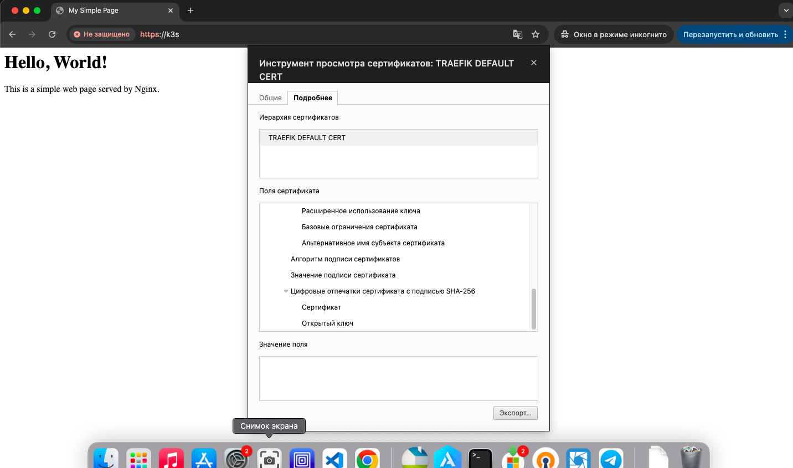

# Домашнее задание к занятию «Конфигурация приложений»

### Цель задания

В тестовой среде Kubernetes необходимо создать конфигурацию и продемонстрировать работу приложения.

------

### Чеклист готовности к домашнему заданию

1. Установленное K8s-решение (например, MicroK8s).
2. Установленный локальный kubectl.
3. Редактор YAML-файлов с подключённым GitHub-репозиторием.

------

### Инструменты и дополнительные материалы, которые пригодятся для выполнения задания

1. [Описание](https://kubernetes.io/docs/concepts/configuration/secret/) Secret.
2. [Описание](https://kubernetes.io/docs/concepts/configuration/configmap/) ConfigMap.
3. [Описание](https://github.com/wbitt/Network-MultiTool) Multitool.

------

### Задание 1. Создать Deployment приложения и решить возникшую проблему с помощью ConfigMap. Добавить веб-страницу

1. Создать Deployment приложения, состоящего из контейнеров nginx и multitool.
2. Решить возникшую проблему с помощью ConfigMap.
3. Продемонстрировать, что pod стартовал и оба конейнера работают.
4. Сделать простую веб-страницу и подключить её к Nginx с помощью ConfigMap. Подключить Service и показать вывод curl или в браузере.
5. Предоставить манифесты, а также скриншоты или вывод необходимых команд.

### Ответ

```
oleg@MacBook-Air-oleg 08 % kubectl apply -f configmap.yaml -n hw08
configmap/my-html-config created
oleg@MacBook-Air-oleg 08 % kubectl apply -f deployment.yaml -n hw08 
deployment.apps/my-app created
oleg@MacBook-Air-oleg 08 % kubectl get pods -n hw08                 
NAME                      READY   STATUS    RESTARTS   AGE
my-app-64874d944b-snngt   2/2     Running   0          22s
oleg@MacBook-Air-oleg 08 % kubectl apply -f service.yaml -n hw08
service/my-nginx-service created
oleg@MacBook-Air-oleg 08 % kubectl get svc my-nginx-service -n hw08
NAME               TYPE        CLUSTER-IP     EXTERNAL-IP   PORT(S)   AGE
my-nginx-service   ClusterIP   10.43.189.18   <none>        80/TCP    34s                                                                                                                         
oleg@MacBook-Air-oleg 08 % kubectl port-forward service/my-nginx-service 8080:80 -n hw08 &
[1] 48603
oleg@MacBook-Air-oleg 08 % Forwarding from 127.0.0.1:8080 -> 80
Forwarding from [::1]:8080 -> 80

oleg@MacBook-Air-oleg 08 % curl 127.0.0.1:8080
Handling connection for 8080
<html>
  <head>
    <title>My Simple Page</title>
  </head>
  <body>
    <h1>Hello, World!</h1>
    <p>This is a simple web page served by Nginx.</p>
  </body>
</html>
oleg@MacBook-Air-oleg 08 % 
```
------

### Задание 2. Создать приложение с вашей веб-страницей, доступной по HTTPS 

1. Создать Deployment приложения, состоящего из Nginx.
2. Создать собственную веб-страницу и подключить её как ConfigMap к приложению.
3. Выпустить самоподписной сертификат SSL. Создать Secret для использования сертификата.
4. Создать Ingress и необходимый Service, подключить к нему SSL в вид. Продемонстировать доступ к приложению по HTTPS. 
4. Предоставить манифесты, а также скриншоты или вывод необходимых команд.

### Ответ

```
oleg@MacBook-Air-oleg 08 % openssl req -x509 -nodes -days 365 -newkey rsa:2048 -keyout tls.key -out tls.crt -subj "/CN=my-secure-app"                                     
..+......+........+.+.....................+.....+.......+...........+.......+++++++++++++++++++++++++++++++++++++++*..+....+...+...+.....+.+........+.......+.....+....+..+....+......+........+....+..+.........+....+..+....+.........+........+....+......+..+++++++++++++++++++++++++++++++++++++++*...+......+...+...+..+...+.......+..+.+..............+....+..+...+...............+....+......+.....+.......+............+..+...+...+....++++++
.+.........+..+.......+...+++++++++++++++++++++++++++++++++++++++*.....+......+...+......+.+.....+.+...+++++++++++++++++++++++++++++++++++++++*..............+......+.....+....+.....+.......+........+...........................+.+.........+.....+.+..+...+.........+.+..+...........................+.+...+...........+......+...+................+...+...+........+......+.+..+...+...+.+...+............+...+..+......+.......+...+.....+..................+...............+......+...+.+......+........+...+............+......+......+....+..............+.+..............+......+..........+..++++++
-----
oleg@MacBook-Air-oleg 08 % 
oleg@MacBook-Air-oleg 08 % kubectl create secret tls my-ssl-secret --cert=tls.crt --key=tls.key -n hw082
secret/my-ssl-secret created
oleg@MacBook-Air-oleg 08 % kubectl apply -f configmap.yaml -n hw082
configmap/my-html-config created
oleg@MacBook-Air-oleg 08 % kubectl apply -f nginx-deployment.yaml -n hw082
deployment.apps/nginx-deployment created
oleg@MacBook-Air-oleg 08 % kubectl apply -f nginx-service.yaml -n hw082
service/nginx-service created
oleg@MacBook-Air-oleg 08 % kubectl apply -f nginx-ingress.yaml -n hw082
ingress.networking.k8s.io/nginx-ingress created
oleg@MacBook-Air-oleg 08 % kubectl get pods -n hw082
NAME                                READY   STATUS    RESTARTS   AGE
nginx-deployment-6ff84fb9bb-6vxjf   1/1     Running   0          2m42s
oleg@MacBook-Air-oleg 08 % kubectl get ingress nginx-ingress -n hw082
NAME            CLASS     HOSTS   ADDRESS         PORTS     AGE
nginx-ingress   traefik   k3s     192.168.2.199   80, 443   33s
```



------

### Правила приёма работы

1. Домашняя работа оформляется в своём GitHub-репозитории в файле README.md. Выполненное домашнее задание пришлите ссылкой на .md-файл в вашем репозитории.
2. Файл README.md должен содержать скриншоты вывода необходимых команд `kubectl`, а также скриншоты результатов.
3. Репозиторий должен содержать тексты манифестов или ссылки на них в файле README.md.

------