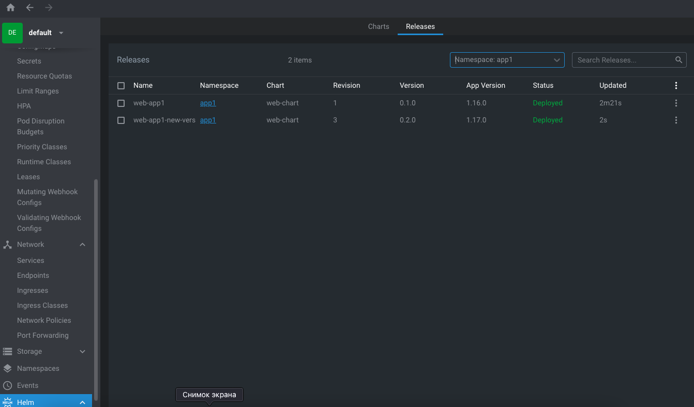
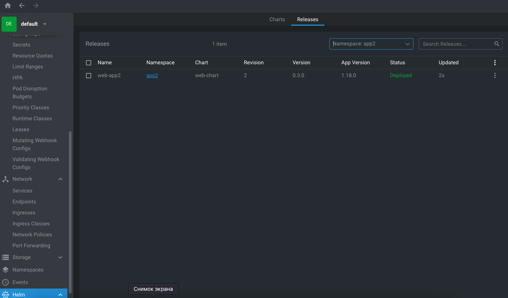

# Домашнее задание к занятию «Helm»

### Цель задания

В тестовой среде Kubernetes необходимо установить и обновить приложения с помощью Helm.

------

### Чеклист готовности к домашнему заданию

1. Установленное k8s-решение, например, MicroK8S.
2. Установленный локальный kubectl.
3. Установленный локальный Helm.
4. Редактор YAML-файлов с подключенным репозиторием GitHub.

------

### Инструменты и дополнительные материалы, которые пригодятся для выполнения задания

1. [Инструкция](https://helm.sh/docs/intro/install/) по установке Helm. [Helm completion](https://helm.sh/docs/helm/helm_completion/).

------

### Задание 1. Подготовить Helm-чарт для приложения

1. Необходимо упаковать приложение в чарт для деплоя в разные окружения. 
2. Каждый компонент приложения деплоится отдельным deployment’ом или statefulset’ом.
3. В переменных чарта измените образ приложения для изменения версии.

------
### Задание 2. Запустить две версии в разных неймспейсах

1. Подготовив чарт, необходимо его проверить. Запуститe несколько копий приложения.
2. Одну версию в namespace=app1, вторую версию в том же неймспейсе, третью версию в namespace=app2.
3. Продемонстрируйте результат.

### Ответ




```
oleg@MacBook-Air-oleg helm % helm create web-chart
WARNING: Kubernetes configuration file is group-readable. This is insecure. Location: /Users/oleg/.kube/config
WARNING: Kubernetes configuration file is world-readable. This is insecure. Location: /Users/oleg/.kube/config
Creating web-chart
oleg@MacBook-Air-oleg helm % helm install web-app1 ./web-chart -n app1
WARNING: Kubernetes configuration file is group-readable. This is insecure. Location: /Users/oleg/.kube/config
WARNING: Kubernetes configuration file is world-readable. This is insecure. Location: /Users/oleg/.kube/config
Error: INSTALLATION FAILED: create: failed to create: namespaces "app1" not found
oleg@MacBook-Air-oleg helm % helm install web-app1 ./web-chart -n app1
WARNING: Kubernetes configuration file is group-readable. This is insecure. Location: /Users/oleg/.kube/config
WARNING: Kubernetes configuration file is world-readable. This is insecure. Location: /Users/oleg/.kube/config
NAME: web-app1
LAST DEPLOYED: Thu Dec 26 22:58:36 2024
NAMESPACE: app1
STATUS: deployed
REVISION: 1
NOTES:
1. Get the application URL by running these commands:
  export POD_NAME=$(kubectl get pods --namespace app1 -l "app.kubernetes.io/name=web-chart,app.kubernetes.io/instance=web-app1" -o jsonpath="{.items[0].metadata.name}")
  export CONTAINER_PORT=$(kubectl get pod --namespace app1 $POD_NAME -o jsonpath="{.spec.containers[0].ports[0].containerPort}")
  echo "Visit http://127.0.0.1:8080 to use your application"
  kubectl --namespace app1 port-forward $POD_NAME 8080:$CONTAINER_PORT
oleg@MacBook-Air-oleg helm % helm install web-app1-new_version ./web-chart -n app1
WARNING: Kubernetes configuration file is group-readable. This is insecure. Location: /Users/oleg/.kube/config
WARNING: Kubernetes configuration file is world-readable. This is insecure. Location: /Users/oleg/.kube/config
Error: INSTALLATION FAILED: release name "web-app1-new_version": invalid release name, must match regex ^[a-z0-9]([-a-z0-9]*[a-z0-9])?(\.[a-z0-9]([-a-z0-9]*[a-z0-9])?)*$ and the length must not be longer than 53
oleg@MacBook-Air-oleg helm % helm install web-app1-new-version ./web-chart -n app1
WARNING: Kubernetes configuration file is group-readable. This is insecure. Location: /Users/oleg/.kube/config
WARNING: Kubernetes configuration file is world-readable. This is insecure. Location: /Users/oleg/.kube/config
NAME: web-app1-new-version
LAST DEPLOYED: Thu Dec 26 22:59:33 2024
NAMESPACE: app1
STATUS: deployed
REVISION: 1
NOTES:
1. Get the application URL by running these commands:
  export POD_NAME=$(kubectl get pods --namespace app1 -l "app.kubernetes.io/name=web-chart,app.kubernetes.io/instance=web-app1-new-version" -o jsonpath="{.items[0].metadata.name}")
  export CONTAINER_PORT=$(kubectl get pod --namespace app1 $POD_NAME -o jsonpath="{.spec.containers[0].ports[0].containerPort}")
  echo "Visit http://127.0.0.1:8080 to use your application"
  kubectl --namespace app1 port-forward $POD_NAME 8080:$CONTAINER_PORT
oleg@MacBook-Air-oleg helm % helm install web-app2 ./web-chart -n app2
WARNING: Kubernetes configuration file is group-readable. This is insecure. Location: /Users/oleg/.kube/config
WARNING: Kubernetes configuration file is world-readable. This is insecure. Location: /Users/oleg/.kube/config
NAME: web-app2
LAST DEPLOYED: Thu Dec 26 22:59:46 2024
NAMESPACE: app2
STATUS: deployed
REVISION: 1
NOTES:
1. Get the application URL by running these commands:
  export POD_NAME=$(kubectl get pods --namespace app2 -l "app.kubernetes.io/name=web-chart,app.kubernetes.io/instance=web-app2" -o jsonpath="{.items[0].metadata.name}")
  export CONTAINER_PORT=$(kubectl get pod --namespace app2 $POD_NAME -o jsonpath="{.spec.containers[0].ports[0].containerPort}")
  echo "Visit http://127.0.0.1:8080 to use your application"
  kubectl --namespace app2 port-forward $POD_NAME 8080:$CONTAINER_PORT
oleg@MacBook-Air-oleg helm % helm upgrade web-app1-new-version ./web-chart -n app1
WARNING: Kubernetes configuration file is group-readable. This is insecure. Location: /Users/oleg/.kube/config
WARNING: Kubernetes configuration file is world-readable. This is insecure. Location: /Users/oleg/.kube/config
Release "web-app1-new-version" has been upgraded. Happy Helming!
NAME: web-app1-new-version
LAST DEPLOYED: Thu Dec 26 23:00:38 2024
NAMESPACE: app1
STATUS: deployed
REVISION: 2
NOTES:
1. Get the application URL by running these commands:
  export POD_NAME=$(kubectl get pods --namespace app1 -l "app.kubernetes.io/name=web-chart,app.kubernetes.io/instance=web-app1-new-version" -o jsonpath="{.items[0].metadata.name}")
  export CONTAINER_PORT=$(kubectl get pod --namespace app1 $POD_NAME -o jsonpath="{.spec.containers[0].ports[0].containerPort}")
  echo "Visit http://127.0.0.1:8080 to use your application"
  kubectl --namespace app1 port-forward $POD_NAME 8080:$CONTAINER_PORT
oleg@MacBook-Air-oleg helm % helm upgrade web-app1-new-version ./web-chart -n app1
WARNING: Kubernetes configuration file is group-readable. This is insecure. Location: /Users/oleg/.kube/config
WARNING: Kubernetes configuration file is world-readable. This is insecure. Location: /Users/oleg/.kube/config
Release "web-app1-new-version" has been upgraded. Happy Helming!
NAME: web-app1-new-version
LAST DEPLOYED: Thu Dec 26 23:00:54 2024
NAMESPACE: app1
STATUS: deployed
REVISION: 3
NOTES:
1. Get the application URL by running these commands:
  export POD_NAME=$(kubectl get pods --namespace app1 -l "app.kubernetes.io/name=web-chart,app.kubernetes.io/instance=web-app1-new-version" -o jsonpath="{.items[0].metadata.name}")
  export CONTAINER_PORT=$(kubectl get pod --namespace app1 $POD_NAME -o jsonpath="{.spec.containers[0].ports[0].containerPort}")
  echo "Visit http://127.0.0.1:8080 to use your application"
  kubectl --namespace app1 port-forward $POD_NAME 8080:$CONTAINER_PORT
oleg@MacBook-Air-oleg helm % helm upgrade web-app2 ./web-chart -n app2     
WARNING: Kubernetes configuration file is group-readable. This is insecure. Location: /Users/oleg/.kube/config
WARNING: Kubernetes configuration file is world-readable. This is insecure. Location: /Users/oleg/.kube/config
Release "web-app2" has been upgraded. Happy Helming!
NAME: web-app2
LAST DEPLOYED: Thu Dec 26 23:02:31 2024
NAMESPACE: app2
STATUS: deployed
REVISION: 2
NOTES:
1. Get the application URL by running these commands:
  export POD_NAME=$(kubectl get pods --namespace app2 -l "app.kubernetes.io/name=web-chart,app.kubernetes.io/instance=web-app2" -o jsonpath="{.items[0].metadata.name}")
  export CONTAINER_PORT=$(kubectl get pod --namespace app2 $POD_NAME -o jsonpath="{.spec.containers[0].ports[0].containerPort}")
  echo "Visit http://127.0.0.1:8080 to use your application"
  kubectl --namespace app2 port-forward $POD_NAME 8080:$CONTAINER_PORT
```
### Правила приёма работы

1. Домашняя работа оформляется в своём Git репозитории в файле README.md. Выполненное домашнее задание пришлите ссылкой на .md-файл в вашем репозитории.
2. Файл README.md должен содержать скриншоты вывода необходимых команд `kubectl`, `helm`, а также скриншоты результатов.
3. Репозиторий должен содержать тексты манифестов или ссылки на них в файле README.md.
