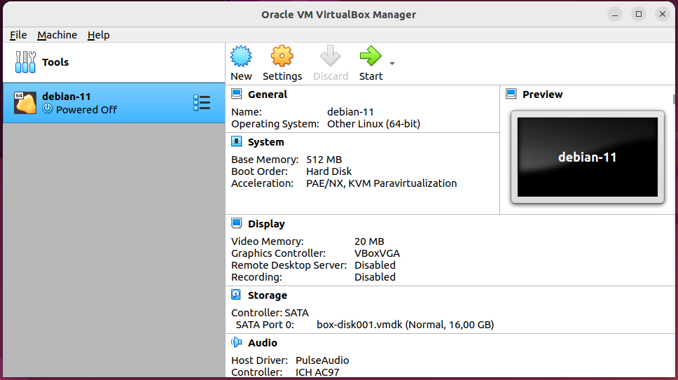

# Домашнее задание к занятию «Введение в Terraform»

### Цели задания

1. Установить и настроить Terrafrom.
2. Научиться использовать готовый код.

------
### Задание 1

1. Перейдите в каталог [**src**](https://github.com/netology-code/ter-homeworks/tree/main/01/src). Скачайте все необходимые зависимости, использованные в проекте. 
2. Изучите файл **.gitignore**. В каком terraform-файле, согласно этому .gitignore, допустимо сохранить личную, секретную информацию?
#### Ответ:
    - Судя по файлу gitignore это personal.auto.tfvars
3. Выполните код проекта. Найдите  в state-файле секретное содержимое созданного ресурса **random_password**, пришлите в качестве ответа конкретный ключ и его значение.
#### Ответ:
```
"result": "AkiPvmNY5G4wAHwd"
```
4. Раскомментируйте блок кода, примерно расположенный на строчках 29–42 файла **main.tf**.
Выполните команду ```terraform validate```. Объясните, в чём заключаются намеренно допущенные ошибки. Исправьте их.

#### Ответ:
- В блоке ресурса должно быть указано два параметра имя и тип.
    - должно быть ```resource "docker_image" "nginx"```

```
│ Error: Missing name for resource
│ 
│   on main.tf line 24, in resource "docker_image":
│   24: resource "docker_image" {
│ 
│ All resource blocks must have 2 labels (type, name).
```
- Имя должно начинаться с буквы или подчеркивания
    - должно быть ```resource "docker_container" "nginx"```

```
│ Error: Invalid resource name
│ 
│   on main.tf line 29, in resource "docker_container" "1nginx":
│   29: resource "docker_container" "1nginx" {
│ 
│ A name must start with a letter or underscore and may contain only letters, digits, underscores, and dashes.
```
- Ошибка в имени переменной.
    - должно быть ```name  = "example_${random_password.random_string.result}"```
```
│ Error: Reference to undeclared resource
│ 
│   on main.tf line 31, in resource "docker_container" "nginx":
│   31:   name  = "example_${random_password.random_string_FAKE.resulT}"
│ 
│ A managed resource "random_password" "random_string_FAKE" has not been declared in the root module.
```

5. Выполните код. В качестве ответа приложите: исправленный фрагмент кода и вывод команды ```docker ps```.

```
oleg@ub22:~/git/ter-homeworks/01/src$ docker ps
CONTAINER ID   IMAGE          COMMAND                  CREATED          STATUS          PORTS                  NAMES
9399297df5c8   a6bd71f48f68   "/docker-entrypoint.…"   19 seconds ago   Up 18 seconds   0.0.0.0:8000->80/tcp   example_AkiPvmNY5G4wAHwd
```
6. Замените имя docker-контейнера в блоке кода на ```hello_world```. Не перепутайте имя контейнера и имя образа. Мы всё ещё продолжаем использовать name = "nginx:latest". Выполните команду ```terraform apply -auto-approve```.
Объясните своими словами, в чём может быть опасность применения ключа  ```-auto-approve```. Догадайтесь или нагуглите зачем может пригодиться данный ключ? В качестве ответа дополнительно приложите вывод команды ```docker ps```.
#### Ответ:
- Использование ```-auto-approve``` опасно, так как нет валидации вносимых изменений. По ошибке можно перезаписать уже существующие объекты. О чем тераформ предупреждает, если ключа автоапрув нет ```# docker_container.nginx must be replaced```
```
oleg@ub22:~/git/ter-homeworks/01/src$ docker ps
CONTAINER ID   IMAGE          COMMAND                  CREATED         STATUS         PORTS                  NAMES
6df00e8e3339   a6bd71f48f68   "/docker-entrypoint.…"   2 seconds ago   Up 2 seconds   0.0.0.0:8000->80/tcp   hello_world
```

8. Уничтожьте созданные ресурсы с помощью **terraform**. Убедитесь, что все ресурсы удалены. Приложите содержимое файла **terraform.tfstate**. 
```
{
  "version": 4,
  "terraform_version": "1.5.7",
  "serial": 17,
  "lineage": "7cb40649-fb32-59e7-8e78-4040a8b6d4f4",
  "outputs": {},
  "resources": [],
  "check_results": null
}
```
9. Объясните, почему при этом не был удалён docker-образ **nginx:latest**. Ответ **обязательно** подкрепите строчкой из документации [**terraform провайдера docker**](https://docs.comcloud.xyz/providers/kreuzwerker/docker/latest/docs).  (ищите в классификаторе resource docker_image )
#### Ответ:
- Образ не был удален, так как установлен параметр ```keep_locally```

```
keep_locally (Boolean) If true, then the Docker image won't be deleted on destroy operation. If this is false, it will delete the image from the docker local storage on destroy operation.
```

------

## Дополнительное задание (со звёздочкой*)

**Настоятельно рекомендуем выполнять все задания со звёздочкой.** Они помогут глубже разобраться в материале.   
Задания со звёздочкой дополнительные, не обязательные к выполнению и никак не повлияют на получение вами зачёта по этому домашнему заданию. 

### Задание 2*

1. Изучите в документации provider [**Virtualbox**](https://docs.comcloud.xyz/providers/shekeriev/virtualbox/latest/docs) от 
shekeriev.
2. Создайте с его помощью любую виртуальную машину. Чтобы не использовать VPN, советуем выбрать любой образ с расположением в GitHub из [**списка**](https://www.vagrantbox.es/).

В качестве ответа приложите plan для создаваемого ресурса и скриншот созданного в VB ресурса. 

```
terraform {
  required_providers {
    virtualbox = {
      source = "shekeriev/virtualbox"
      version = "0.0.4"
    }
  }
}

provider "virtualbox" {
  delay      = 60
  mintimeout = 5
}

resource "virtualbox_vm" "node1" {
  name   = "debian-11"
  image  = "https://app.vagrantup.com/shekeriev/boxes/debian-11/versions/0.2/providers/virtualbox.box"
  cpus      = 1
  memory    = "512 mib"
  user_data = file("/home/oleg/git/ter-homeworks/01/src2/user_data2")

  network_adapter {
    type           = "hostonly"
    device         = "IntelPro1000MTDesktop"
    host_interface = "vboxnet1"
    # On Windows use this instead
    # host_interface = "VirtualBox Host-Only Ethernet Adapter"
  }
}

output "IPAddress" {
  value = element(virtualbox_vm.node1.*.network_adapter.0.ipv4_address, 1)
}
```

