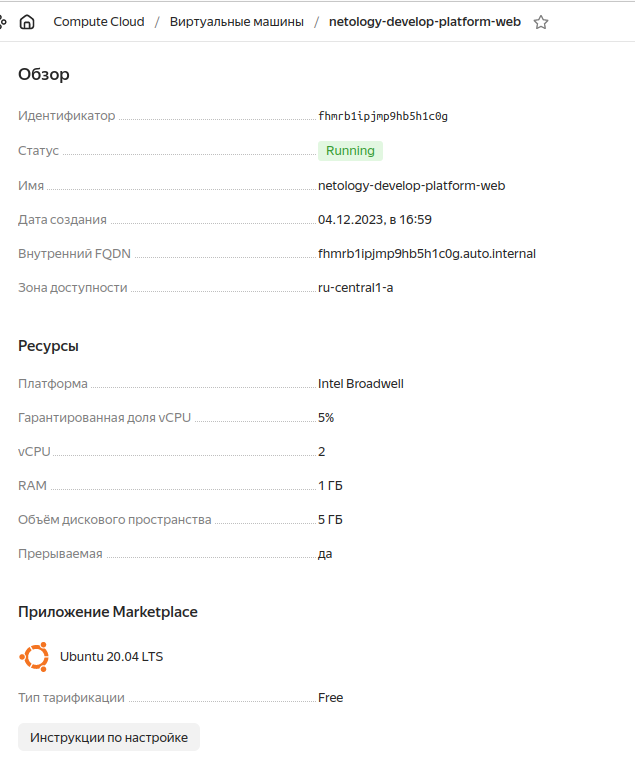
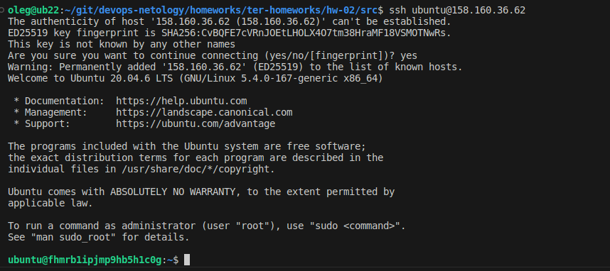

# Домашнее задание к занятию «Основы Terraform. Yandex Cloud»

### Цели задания

1. Создать свои ресурсы в облаке Yandex Cloud с помощью Terraform.
2. Освоить работу с переменными Terraform.


### Задание 0

1. Ознакомьтесь с [документацией к security-groups в Yandex Cloud](https://cloud.yandex.ru/docs/vpc/concepts/security-groups?from=int-console-help-center-or-nav).
2. Запросите preview-доступ к этому функционалу в личном кабинете Yandex Cloud. Обычно его выдают в течение 24-х часов.
https://console.cloud.yandex.ru/folders/<ваш cloud_id>/vpc/security-groups.   
Этот функционал понадобится к следующей лекции. 

### Задание 1
В качестве ответа всегда полностью прикладывайте ваш terraform-код в git.  Убедитесь что ваша версия **Terraform** =1.5.Х (версия 1.6.Х может вызывать проблемы с Яндекс провайдером) 

1. Изучите проект. В файле variables.tf объявлены переменные для Yandex provider.
2. Переименуйте файл personal.auto.tfvars_example в personal.auto.tfvars. Заполните переменные: идентификаторы облака, токен доступа. Благодаря .gitignore этот файл не попадёт в публичный репозиторий. **Вы можете выбрать иной способ безопасно передать секретные данные в terraform.**
3. Сгенерируйте или используйте свой текущий ssh-ключ. Запишите его открытую часть в переменную **vms_ssh_root_key**.
4. Инициализируйте проект, выполните код. Исправьте намеренно допущенные синтаксические ошибки. Ищите внимательно, посимвольно. Ответьте, в чём заключается их суть.
  #### Ответ:
  - Нет платформы standart-v4, заменил на standard-v1 https://cloud.yandex.com/en/docs/compute/concepts/vm-platforms
```
Error: Error while requesting API to create instance: server-request-id = 6c4f38c9-ee93-4d4f-b71e-73bcbf4b9cc4 server-trace-id = d719fee9de97d0a6:72568081111f84f0:d719fee9de97d0a6:1 client-request-id = b47efdcd-50f2-4db6-931d-2cc12315e8f6 client-trace-id = e51d5c23-5339-4337-b3c2-0845016e9005 rpc error: code = FailedPrecondition desc = Platform "standart-v4" not found
```
  - Минимальное количество ядер 2 https://cloud.yandex.ru/docs/compute/concepts/performance-levels?
```
Error: Error while requesting API to create instance: server-request-id = d005f79b-1f85-4b9d-8991-ad8b9335b0c7 server-trace-id = e145e3b5f1a03bcb:4354dc3352096229:e145e3b5f1a03bcb:1 client-request-id = bfd50326-ef90-41c7-b2ab-f7aeb0bc2c45 client-trace-id = 3106e89c-c0ac-4568-97e4-f7082f3b49e3 rpc error: code = InvalidArgument desc = the specified number of cores is not available on platform "standard-v1"; allowed core number: 2, 4
```
5. Ответьте, как в процессе обучения могут пригодиться параметры ```preemptible = true``` и ```core_fraction=5``` в параметрах ВМ. Ответ в документации Yandex Cloud.
  #### Ответ:
  - ```preemptible = true``` Прерываемые виртуальные машины доступны по более низкой цене в сравнении с обычными, однако не обеспечивают отказоустойчивости. https://cloud.yandex.ru/docs/compute/concepts/preemptible-vm
  - ```core_fraction=5``` Выделенный уровень производительности ядра, 5% минимальное заначение гарантированной производительности, выделяемой ядрам вм. Так же для снижения стоимости. https://cloud.yandex.ru/docs/compute/concepts/performance-levels

В качестве решения приложите:

- скриншот ЛК Yandex Cloud с созданной ВМ;
- скриншот успешного подключения к консоли ВМ через ssh. К OS ubuntu "out of a box, те из коробки" необходимо подключаться под пользователем ubuntu: ```"ssh ubuntu@vm_ip_address"```; Вы познакомитесь с тем как при создании ВМ кастомизировать пользователя в  блоке metadata в следующей лекции.
- ответы на вопросы.
  #### Ответ:
  - New VM

  - ssh connect


### Задание 2

1. Изучите файлы проекта.
2. Замените все хардкод-**значения** для ресурсов **yandex_compute_image** и **yandex_compute_instance** на **отдельные** переменные. К названиям переменных ВМ добавьте в начало префикс **vm_web_** .  Пример: **vm_web_name**.
2. Объявите нужные переменные в файле variables.tf, обязательно указывайте тип переменной. Заполните их **default** прежними значениями из main.tf. 
3. Проверьте terraform plan. Изменений быть не должно. 
  #### Ответ:
```
oleg@ub22:~/git/devops-netology/homeworks/ter-homeworks/hw-02/src$ terraform plan
data.yandex_compute_image.ubuntu: Reading...
yandex_vpc_network.develop: Refreshing state... [id=enp7i4p224u668dvh105]
data.yandex_compute_image.ubuntu: Read complete after 1s [id=fd839i1233e8krfrf92s]
yandex_vpc_subnet.develop: Refreshing state... [id=e9bailr2sludadtfctvg]
yandex_compute_instance.platform: Refreshing state... [id=fhmrb1ipjmp9hb5h1c0g]

No changes. Your infrastructure matches the configuration.

Terraform has compared your real infrastructure against your configuration and found no differences, so no changes are needed.
```

### Задание 3

1. Создайте в корне проекта файл 'vms_platform.tf' . Перенесите в него все переменные первой ВМ.
2. Скопируйте блок ресурса и создайте с его помощью вторую ВМ в файле main.tf: **"netology-develop-platform-db"** ,  cores  = 2, memory = 2, core_fraction = 20. Объявите её переменные с префиксом **vm_db_** в том же файле ('vms_platform.tf').
3. Примените изменения.
  #### Ответ:
  - Переменные в ```variables.tf```
```
###custom vars

variable "vm_web_image_family" {
  type        = string
  default     = "ubuntu-2004-lts"
  description = "yandex compute image family"
}

variable "vm_web_resource" {
  type = map
  default = {
      name = "netology-develop-platform-web"
      platform_id = "standard-v1"
      cores = 2
      memory = 1
      core_fraction = 5
    }
  description = "yandex compute instance vars"
}
```
  - Блоки из ```main.tf``` с примененными переменными
```
data "yandex_compute_image" "ubuntu" {
  family = var.vm_web_image_family
}
resource "yandex_compute_instance" "platform" {
  name        = var.vm_web_resource["name"]
  platform_id = var.vm_web_resource["platform_id"]
  resources {
    cores         = var.vm_web_resource["cores"]
    memory        = var.vm_web_resource["memory"]
    core_fraction = var.vm_web_resource["core_fraction"]
  }
  boot_disk {
    initialize_params {
      image_id = data.yandex_compute_image.ubuntu.image_id
    }
  }
  scheduling_policy {
    preemptible = true
  }
  network_interface {
    subnet_id = yandex_vpc_subnet.develop.id
    nat       = true
  }

  metadata = {
    serial-port-enable = 1
    ssh-keys           = "ubuntu:${var.vms_ssh_root_key}"
  }

}
```
### Задание 4

1. Объявите в файле outputs.tf output типа map, содержащий { instance_name = external_ip } для каждой из ВМ.
2. Примените изменения.

В качестве решения приложите вывод значений ip-адресов команды ```terraform output```.
  #### Ответ:
```
external_ip = {
  "netology-develop-platform-db" = "158.160.115.210"
  "netology-develop-platform-web" = "158.160.36.62"
}
```

### Задание 5

1. В файле locals.tf опишите в **одном** local-блоке имя каждой ВМ, используйте интерполяцию ${..} с несколькими переменными по примеру из лекции.
2. Замените переменные с именами ВМ из файла variables.tf на созданные вами local-переменные.
3. Примените изменения.
  #### Ответ:
```
locals { 
    platform_name = "netology-develop-platform"
    node01 = "web"
    node01_name = "${local.platform_name}-${local.node01}"
    node02 = "db"
    node02_name = "${local.platform_name}-${local.node02}"
}
```

### Задание 6

1. Вместо использования трёх переменных  ".._cores",".._memory",".._core_fraction" в блоке  resources {...}, объедините их в переменные типа **map** с именами "vm_web_resources" и "vm_db_resources". В качестве продвинутой практики попробуйте создать одну map-переменную **vms_resources** и уже внутри неё конфиги обеих ВМ — вложенный map.
2. Также поступите с блоком **metadata {serial-port-enable, ssh-keys}**, эта переменная должна быть общая для всех ваших ВМ.
3. Найдите и удалите все более не используемые переменные проекта.
4. Проверьте terraform plan. Изменений быть не должно.
  #### Ответ:
  - исходники в ```src/```
------

## Дополнительное задание (со звёздочкой*)

**Настоятельно рекомендуем выполнять все задания со звёздочкой.**   
Они помогут глубже разобраться в материале. Задания со звёздочкой дополнительные, не обязательные к выполнению и никак не повлияют на получение вами зачёта по этому домашнему заданию. 

### Задание 7*

Изучите содержимое файла console.tf. Откройте terraform console, выполните следующие задания: 

1. Напишите, какой командой можно отобразить **второй** элемент списка test_list.
```
> local.test_list[1]
"staging"
```

2. Найдите длину списка test_list с помощью функции length(<имя переменной>).
```
> length(["develop", "staging", "production"]) 
3
```
3. Напишите, какой командой можно отобразить значение ключа admin из map test_map.
```
> local.test_map["admin"]
"John"
```
4. Напишите interpolation-выражение, результатом которого будет: "John is admin for production server based on OS ubuntu-20-04 with X vcpu, Y ram and Z virtual disks", используйте данные из переменных test_list, test_map, servers и функцию length() для подстановки значений.

**Примечание**: если не догадаетесь как вычленить слово "admin", погуглите: "terraform get keys of map"

```
> "${local.test_map["admin"]} is admin for ${local.test_list[length(local.test_list)-1]} server based on OS ${local.servers.production.image} with ${local.servers.production.cpu} vcpu, ${local.servers.production.ram} ram and ${length(local.servers.production.disks)} virtual disks"
"John is admin for production server based on OS ubuntu-20-04 with 10 vcpu, 40 ram and 4 virtual disks"
```

В качестве решения предоставьте необходимые команды и их вывод.

