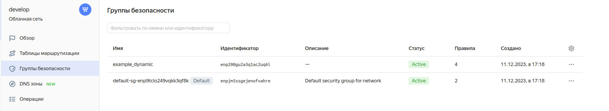

# Домашнее задание к занятию «Управляющие конструкции в коде Terraform»

### Цели задания

1. Отработать основные принципы и методы работы с управляющими конструкциями Terraform.
2. Освоить работу с шаблонизатором Terraform (Interpolation Syntax).

------

### Задание 1

1. Изучите проект.
2. Заполните файл personal.auto.tfvars.
3. Инициализируйте проект, выполните код. Он выполнится, даже если доступа к preview нет.

Примечание. Если у вас не активирован preview-доступ к функционалу «Группы безопасности» в Yandex Cloud, запросите доступ у поддержки облачного провайдера. Обычно его выдают в течение 24-х часов.

Приложите скриншот входящих правил «Группы безопасности» в ЛК Yandex Cloud или скриншот отказа в предоставлении доступа к preview-версии.



------

### Задание 2

1. Создайте файл count-vm.tf. Опишите в нём создание двух **одинаковых** ВМ  web-1 и web-2 (не web-0 и web-1) с минимальными параметрами, используя мета-аргумент **count loop**. Назначьте ВМ созданную в первом задании группу безопасности.(как это сделать узнайте в документации провайдера yandex/compute_instance )
2. Создайте файл for_each-vm.tf. Опишите в нём создание двух ВМ для баз данных с именами "main" и "replica" **разных** по cpu/ram/disk , используя мета-аргумент **for_each loop**. Используйте для обеих ВМ одну общую переменную типа:
```
variable "each_vm" {
  type = list(object({  vm_name=string, cpu=number, ram=number, disk=number }))
}
```  
При желании внесите в переменную все возможные параметры.
4. ВМ из пункта 2.1 должны создаваться после создания ВМ из пункта 2.2.
5. Используйте функцию file в local-переменной для считывания ключа ~/.ssh/id_rsa.pub и его последующего использования в блоке metadata, взятому из ДЗ 2.
6. Инициализируйте проект, выполните код.

#### Ответ:

```
Terraform will perform the following actions:

  # yandex_compute_instance.db["main"] will be created
  + resource "yandex_compute_instance" "db" {
      + created_at                = (known after apply)
      + description               = "main"
      + folder_id                 = "b1g1ptkqd96nl8peatpn"
      + fqdn                      = (known after apply)
      + gpu_cluster_id            = (known after apply)
      + hostname                  = "main"
      + id                        = (known after apply)
      + metadata                  = {
          + "serial-port-enable" = "1"
          + "ssh-keys"           = "ubuntu:ssh-ed25519 AAAAC3NzaC1lZDI1NTE5AAAAIDzuXvGEstWnn3ZVSGYuG7tvaUY4Bz3SN8gxogxL1DAS"
        }
      + name                      = "main"
      + network_acceleration_type = "standard"
      + platform_id               = "standard-v1"
      + service_account_id        = (known after apply)
      + status                    = (known after apply)
      + zone                      = "ru-central1-a"

      + boot_disk {
          + auto_delete = true
          + device_name = (known after apply)
          + disk_id     = (known after apply)
          + mode        = (known after apply)

          + initialize_params {
              + block_size  = (known after apply)
              + description = (known after apply)
              + image_id    = "fd84nt41ssoaapgql97p"
              + name        = (known after apply)
              + size        = 10
              + snapshot_id = (known after apply)
              + type        = "network-hdd"
            }
        }

      + network_interface {
          + index              = (known after apply)
          + ip_address         = (known after apply)
          + ipv4               = true
          + ipv6               = (known after apply)
          + ipv6_address       = (known after apply)
          + mac_address        = (known after apply)
          + nat                = true
          + nat_ip_address     = (known after apply)
          + nat_ip_version     = (known after apply)
          + security_group_ids = (known after apply)
          + subnet_id          = "e9b6qcooim2dut6b4i66"
        }

      + resources {
          + core_fraction = 20
          + cores         = 4
          + memory        = 4
        }

      + scheduling_policy {
          + preemptible = true
        }
    }

  # yandex_compute_instance.db["replica"] will be created
  + resource "yandex_compute_instance" "db" {
      + created_at                = (known after apply)
      + description               = "replica"
      + folder_id                 = "b1g1ptkqd96nl8peatpn"
      + fqdn                      = (known after apply)
      + gpu_cluster_id            = (known after apply)
      + hostname                  = "replica"
      + id                        = (known after apply)
      + metadata                  = {
          + "serial-port-enable" = "1"
          + "ssh-keys"           = "ubuntu:ssh-ed25519 AAAAC3NzaC1lZDI1NTE5AAAAIDzuXvGEstWnn3ZVSGYuG7tvaUY4Bz3SN8gxogxL1DAS"
        }
      + name                      = "replica"
      + network_acceleration_type = "standard"
      + platform_id               = "standard-v1"
      + service_account_id        = (known after apply)
      + status                    = (known after apply)
      + zone                      = "ru-central1-a"

      + boot_disk {
          + auto_delete = true
          + device_name = (known after apply)
          + disk_id     = (known after apply)
          + mode        = (known after apply)

          + initialize_params {
              + block_size  = (known after apply)
              + description = (known after apply)
              + image_id    = "fd84nt41ssoaapgql97p"
              + name        = (known after apply)
              + size        = 8
              + snapshot_id = (known after apply)
              + type        = "network-hdd"
            }
        }

      + network_interface {
          + index              = (known after apply)
          + ip_address         = (known after apply)
          + ipv4               = true
          + ipv6               = (known after apply)
          + ipv6_address       = (known after apply)
          + mac_address        = (known after apply)
          + nat                = true
          + nat_ip_address     = (known after apply)
          + nat_ip_version     = (known after apply)
          + security_group_ids = (known after apply)
          + subnet_id          = "e9b6qcooim2dut6b4i66"
        }

      + resources {
          + core_fraction = 5
          + cores         = 2
          + memory        = 2
        }

      + scheduling_policy {
          + preemptible = true
        }
    }

  # yandex_compute_instance.web[0] will be created
  + resource "yandex_compute_instance" "web" {
      + created_at                = (known after apply)
      + description               = "web-1"
      + folder_id                 = "b1g1ptkqd96nl8peatpn"
      + fqdn                      = (known after apply)
      + gpu_cluster_id            = (known after apply)
      + hostname                  = "web-1"
      + id                        = (known after apply)
      + metadata                  = {
          + "serial-port-enable" = "1"
          + "ssh-keys"           = "ubuntu:ssh-ed25519 AAAAC3NzaC1lZDI1NTE5AAAAIDzuXvGEstWnn3ZVSGYuG7tvaUY4Bz3SN8gxogxL1DAS"
        }
      + name                      = "web-1"
      + network_acceleration_type = "standard"
      + platform_id               = "standard-v1"
      + service_account_id        = (known after apply)
      + status                    = (known after apply)
      + zone                      = "ru-central1-a"

      + boot_disk {
          + auto_delete = true
          + device_name = (known after apply)
          + disk_id     = (known after apply)
          + mode        = (known after apply)

          + initialize_params {
              + block_size  = (known after apply)
              + description = (known after apply)
              + image_id    = "fd84nt41ssoaapgql97p"
              + name        = (known after apply)
              + size        = (known after apply)
              + snapshot_id = (known after apply)
              + type        = "network-hdd"
            }
        }

      + network_interface {
          + index              = (known after apply)
          + ip_address         = (known after apply)
          + ipv4               = true
          + ipv6               = (known after apply)
          + ipv6_address       = (known after apply)
          + mac_address        = (known after apply)
          + nat                = true
          + nat_ip_address     = (known after apply)
          + nat_ip_version     = (known after apply)
          + security_group_ids = (known after apply)
          + subnet_id          = "e9b6qcooim2dut6b4i66"
        }

      + resources {
          + core_fraction = 5
          + cores         = 2
          + memory        = 1
        }

      + scheduling_policy {
          + preemptible = true
        }
    }

  # yandex_compute_instance.web[1] will be created
  + resource "yandex_compute_instance" "web" {
      + created_at                = (known after apply)
      + description               = "web-2"
      + folder_id                 = "b1g1ptkqd96nl8peatpn"
      + fqdn                      = (known after apply)
      + gpu_cluster_id            = (known after apply)
      + hostname                  = "web-2"
      + id                        = (known after apply)
      + metadata                  = {
          + "serial-port-enable" = "1"
          + "ssh-keys"           = "ubuntu:ssh-ed25519 AAAAC3NzaC1lZDI1NTE5AAAAIDzuXvGEstWnn3ZVSGYuG7tvaUY4Bz3SN8gxogxL1DAS"
        }
      + name                      = "web-2"
      + network_acceleration_type = "standard"
      + platform_id               = "standard-v1"
      + service_account_id        = (known after apply)
      + status                    = (known after apply)
      + zone                      = "ru-central1-a"

      + boot_disk {
          + auto_delete = true
          + device_name = (known after apply)
          + disk_id     = (known after apply)
          + mode        = (known after apply)

          + initialize_params {
              + block_size  = (known after apply)
              + description = (known after apply)
              + image_id    = "fd84nt41ssoaapgql97p"
              + name        = (known after apply)
              + size        = (known after apply)
              + snapshot_id = (known after apply)
              + type        = "network-hdd"
            }
        }

      + network_interface {
          + index              = (known after apply)
          + ip_address         = (known after apply)
          + ipv4               = true
          + ipv6               = (known after apply)
          + ipv6_address       = (known after apply)
          + mac_address        = (known after apply)
          + nat                = true
          + nat_ip_address     = (known after apply)
          + nat_ip_version     = (known after apply)
          + security_group_ids = (known after apply)
          + subnet_id          = "e9b6qcooim2dut6b4i66"
        }

      + resources {
          + core_fraction = 5
          + cores         = 2
          + memory        = 1
        }

      + scheduling_policy {
          + preemptible = true
        }
    }

Plan: 4 to add, 0 to change, 0 to destroy.
```
------

### Задание 3

1. Создайте 3 одинаковых виртуальных диска размером 1 Гб с помощью ресурса yandex_compute_disk и мета-аргумента count в файле **disk_vm.tf** .
2. Создайте в том же файле **одиночную**(использовать count или for_each запрещено из-за задания №4) ВМ c именем "storage"  . Используйте блок **dynamic secondary_disk{..}** и мета-аргумент for_each для подключения созданных вами дополнительных дисков.
#### Ответ:

```
Terraform will perform the following actions:

  # yandex_compute_disk.disks[0] will be created
  + resource "yandex_compute_disk" "disks" {
      + block_size  = 4096
      + created_at  = (known after apply)
      + folder_id   = (known after apply)
      + id          = (known after apply)
      + name        = "hdd-1"
      + product_ids = (known after apply)
      + size        = 1
      + status      = (known after apply)
      + type        = "network-hdd"
      + zone        = "ru-central1-a"
    }

  # yandex_compute_disk.disks[1] will be created
  + resource "yandex_compute_disk" "disks" {
      + block_size  = 4096
      + created_at  = (known after apply)
      + folder_id   = (known after apply)
      + id          = (known after apply)
      + name        = "hdd-2"
      + product_ids = (known after apply)
      + size        = 1
      + status      = (known after apply)
      + type        = "network-hdd"
      + zone        = "ru-central1-a"
    }

  # yandex_compute_disk.disks[2] will be created
  + resource "yandex_compute_disk" "disks" {
      + block_size  = 4096
      + created_at  = (known after apply)
      + folder_id   = (known after apply)
      + id          = (known after apply)
      + name        = "hdd-3"
      + product_ids = (known after apply)
      + size        = 1
      + status      = (known after apply)
      + type        = "network-hdd"
      + zone        = "ru-central1-a"
    }

  # yandex_compute_instance.storage will be created
  + resource "yandex_compute_instance" "storage" {
      + created_at                = (known after apply)
      + description               = "storage"
      + folder_id                 = "b1g1ptkqd96nl8peatpn"
      + fqdn                      = (known after apply)
      + gpu_cluster_id            = (known after apply)
      + hostname                  = "storage"
      + id                        = (known after apply)
      + metadata                  = {
          + "serial-port-enable" = "1"
          + "ssh-keys"           = "ubuntu:ssh-ed25519 AAAAC3NzaC1lZDI1NTE5AAAAIDzuXvGEstWnn3ZVSGYuG7tvaUY4Bz3SN8gxogxL1DAS"
        }
      + name                      = "storage"
      + network_acceleration_type = "standard"
      + platform_id               = "standard-v1"
      + service_account_id        = (known after apply)
      + status                    = (known after apply)
      + zone                      = "ru-central1-a"

      + boot_disk {
          + auto_delete = true
          + device_name = (known after apply)
          + disk_id     = (known after apply)
          + mode        = (known after apply)

          + initialize_params {
              + block_size  = (known after apply)
              + description = (known after apply)
              + image_id    = "fd84nt41ssoaapgql97p"
              + name        = (known after apply)
              + size        = (known after apply)
              + snapshot_id = (known after apply)
              + type        = "network-hdd"
            }
        }

      + network_interface {
          + index              = (known after apply)
          + ip_address         = (known after apply)
          + ipv4               = true
          + ipv6               = (known after apply)
          + ipv6_address       = (known after apply)
          + mac_address        = (known after apply)
          + nat                = true
          + nat_ip_address     = (known after apply)
          + nat_ip_version     = (known after apply)
          + security_group_ids = (known after apply)
          + subnet_id          = "e9bfj4sms33s5j5elo8t"
        }

      + resources {
          + core_fraction = 5
          + cores         = 2
          + memory        = 1
        }

      + scheduling_policy {
          + preemptible = true
        }

      + secondary_disk {
          + auto_delete = false
          + device_name = (known after apply)
          + disk_id     = (known after apply)
          + mode        = "READ_WRITE"
        }
      + secondary_disk {
          + auto_delete = false
          + device_name = (known after apply)
          + disk_id     = (known after apply)
          + mode        = "READ_WRITE"
        }
      + secondary_disk {
          + auto_delete = false
          + device_name = (known after apply)
          + disk_id     = (known after apply)
          + mode        = "READ_WRITE"
        }
    }

Plan: 4 to add, 0 to change, 0 to destroy.
```
------

### Задание 4

1. В файле ansible.tf создайте inventory-файл для ansible.
Используйте функцию tepmplatefile и файл-шаблон для создания ansible inventory-файла из лекции.
Готовый код возьмите из демонстрации к лекции [**demonstration2**](https://github.com/netology-code/ter-homeworks/tree/main/03/demonstration2).
Передайте в него в качестве переменных группы виртуальных машин из задания 2.1, 2.2 и 3.2, т. е. 5 ВМ.
2. Инвентарь должен содержать 3 группы и быть динамическим, т. е. обработать как группу из 2-х ВМ, так и 999 ВМ.
3. Добавьте в инвентарь переменную  [**fqdn**](https://cloud.yandex.ru/docs/compute/concepts/network#hostname).
``` 
[webservers]
web-1 ansible_host=<внешний ip-адрес> fqdn=<имя виртуальной машины>.<регион>.internal
web-2 ansible_host=<внешний ip-адрес> fqdn=<имя виртуальной машины>.<регион>.internal

[databases]
main ansible_host=<внешний ip-адрес> fqdn=<имя виртуальной машины>.<регион>.internal
replica ansible_host<внешний ip-адрес> fqdn=<имя виртуальной машины>.<регион>.internal

[storage]
storage ansible_host=<внешний ip-адрес> fqdn=<имя виртуальной машины>.<регион>.internal
```
4. Выполните код. Приложите скриншот получившегося файла. 

Для общего зачёта создайте в вашем GitHub-репозитории новую ветку terraform-03. Закоммитьте в эту ветку свой финальный код проекта, пришлите ссылку на коммит.   
**Удалите все созданные ресурсы**.

------

## Дополнительные задания (со звездочкой*)

**Настоятельно рекомендуем выполнять все задания со звёздочкой.** Они помогут глубже разобраться в материале.   
Задания со звёздочкой дополнительные, не обязательные к выполнению и никак не повлияют на получение вами зачёта по этому домашнему заданию. 

### Задание 5* (необязательное)
1. Напишите output, который отобразит ВМ из ваших ресурсов count и for_each в виде списка словарей :
``` 
[
 {
  "name" = 'имя ВМ1'
  "id"   = 'идентификатор ВМ1'
  "fqdn" = 'Внутренний FQDN ВМ1'
 },
 {
  "name" = 'имя ВМ2'
  "id"   = 'идентификатор ВМ2'
  "fqdn" = 'Внутренний FQDN ВМ2'
 },
 ....
...итд любое количество ВМ в ресурсе(те требуется итерация по ресурсам, а не хардкод) !!!!!!!!!!!!!!!!!!!!!
]
```
Приложите скриншот вывода команды ```terrafrom output```.

------

### Задание 6* (необязательное)

1. Используя null_resource и local-exec, примените ansible-playbook к ВМ из ansible inventory-файла.
Готовый код возьмите из демонстрации к лекции [**demonstration2**](https://github.com/netology-code/ter-homeworks/tree/main/demonstration2).
3. Модифицируйте файл-шаблон hosts.tftpl. Необходимо отредактировать переменную ```ansible_host="<внешний IP-address или внутренний IP-address если у ВМ отсутвует внешний адрес>```.

Для проверки работы уберите у ВМ внешние адреса(nat=false). Этот вариант используется при работе через bastion-сервер.
Для зачёта предоставьте код вместе с основной частью задания.

### Правила приёма работы

В своём git-репозитории создайте новую ветку terraform-03, закоммитьте в эту ветку свой финальный код проекта. Ответы на задания и необходимые скриншоты оформите в md-файле в ветке terraform-03.

В качестве результата прикрепите ссылку на ветку terraform-03 в вашем репозитории.

Важно. Удалите все созданные ресурсы.

### Критерии оценки

Зачёт ставится, если:

* выполнены все задания,
* ответы даны в развёрнутой форме,
* приложены соответствующие скриншоты и файлы проекта,
* в выполненных заданиях нет противоречий и нарушения логики.

На доработку работу отправят, если:

* задание выполнено частично или не выполнено вообще,
* в логике выполнения заданий есть противоречия и существенные недостатки. 