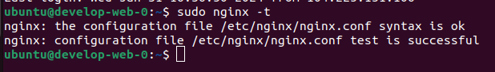

# Домашнее задание к занятию «Продвинутые методы работы с Terraform»

### Цели задания

1. Научиться использовать модули.
2. Отработать операции state.
3. Закрепить пройденный материал.


### Чек-лист готовности к домашнему заданию

1. Зарегистрирован аккаунт в Yandex Cloud. Использован промокод на грант.
2. Установлен инструмент Yandex CLI.
3. Исходный код для выполнения задания расположен в директории [**04/src**](https://github.com/netology-code/ter-homeworks/tree/main/04/src).
4. Любые ВМ, использованные при выполнении задания, должны быть прерываемыми, для экономии средств.

------
### Внимание!! Обязательно предоставляем на проверку получившийся код в виде ссылки на ваш github-репозиторий!
Убедитесь что ваша версия **Terraform** =1.5.X (версия 1.6 может вызывать проблемы с Яндекс провайдером)
Пишем красивый код, хардкод значения не допустимы!
------

### Задание 1

1. Возьмите из [демонстрации к лекции готовый код](https://github.com/netology-code/ter-homeworks/tree/main/04/demonstration1) для создания с помощью двух вызовов remote-модуля -> двух ВМ, относящихся к разным проектам(marketing и analytics) используйте labels для обозначения принадлежности.  В файле cloud-init.yml необходимо использовать переменную для ssh-ключа вместо хардкода. Передайте ssh-ключ в функцию template_file в блоке vars ={} .
Воспользуйтесь [**примером**](https://grantorchard.com/dynamic-cloudinit-content-with-terraform-file-templates/). Обратите внимание, что ssh-authorized-keys принимает в себя список, а не строку.
3. Добавьте в файл cloud-init.yml установку nginx.
4. Предоставьте скриншот подключения к консоли и вывод команды ```sudo nginx -t```, скриншот консоли ВМ yandex cloud с их метками. Откройте terraform console и предоставьте скриншот содержимого модуля. Пример: > module.marketing_vm



```
> module.example-vm
{
  "external_ip_address" = [
    "62.84.118.14",
  ]
  "fqdn" = [
    "stage-web-stage-0.ru-central1.internal",
  ]
  "internal_ip_address" = [
    "10.0.1.5",
  ]
  "labels" = [
    tomap({
      "env" = "stage"
      "project" = "undefined"
    }),
  ]
  "network_interface" = [
    tolist([
      {
        "dns_record" = tolist([])
        "index" = 0
        "ip_address" = "10.0.1.5"
        "ipv4" = true
        "ipv6" = false
        "ipv6_address" = ""
        "ipv6_dns_record" = tolist([])
        "mac_address" = "d0:0d:14:9c:92:c0"
        "nat" = true
        "nat_dns_record" = tolist([])
        "nat_ip_address" = "62.84.118.14"
        "nat_ip_version" = "IPV4"
        "security_group_ids" = toset([])
        "subnet_id" = "e9b85c4cnv7v9trbfmum"
      },
    ]),
  ]
}
```
------

### Задание 2

1. Напишите локальный модуль vpc, который будет создавать 2 ресурса: **одну** сеть и **одну** подсеть в зоне, объявленной при вызове модуля, например: ```ru-central1-a```.
2. Вы должны передать в модуль переменные с названием сети, zone и v4_cidr_blocks.
3. Модуль должен возвращать в root module с помощью output информацию о yandex_vpc_subnet. Пришлите скриншот информации из terraform console о своем модуле. 

```
oleg@ub22:~/git/devops-netology/homeworks/ter-homeworks/hw-04/src$ terraform console
> module.vpc_dev
{
  "network_id" = "enphfr2savd3esaiqubn"
  "subnet_id" = "e9b1s9elb22s3gg9mq7h"
}
```

4. Замените ресурсы yandex_vpc_network и yandex_vpc_subnet созданным модулем. Не забудьте передать необходимые параметры сети из модуля vpc в модуль с виртуальной машиной.
5. Сгенерируйте документацию к модулю с помощью terraform-docs.
 

### Задание 3
1. Выведите список ресурсов в стейте.

2. Полностью удалите из стейта модуль vpc.

3. Полностью удалите из стейта модуль vm.

4. Импортируйте всё обратно. Проверьте terraform plan. Изменений быть не должно.
Приложите список выполненных команд и скриншоты процессы.
```
terraform state list
terraform state rm module.vpc_dev
terraform state rm module.test-vm
terraform import module.vpc_dev.yandex_vpc_network.vpc_net enpk2kegfbg0ub1u552r
terraform import module.vpc_dev.yandex_vpc_subnet.vpc_subnet e9bnk6brteehq9r48uvh
terraform import module.test-vm.data.yandex_compute_image.my_image fd82qs98ootbak6lkmmj
terraform import module.test-vm.yandex_compute_instance.vm[0] fhmnkq62nq7hncds2d60
terraform import module.test-vm.yandex_compute_instance.vm[1] fhm2n30ddhasks6hp6is
```


## Дополнительные задания (со звёздочкой*)

**Настоятельно рекомендуем выполнять все задания со звёздочкой.**   Они помогут глубже разобраться в материале.   
Задания со звёздочкой дополнительные, не обязательные к выполнению и никак не повлияют на получение вами зачёта по этому домашнему заданию. 


### Задание 4*

1. Измените модуль vpc так, чтобы он мог создать подсети во всех зонах доступности, переданных в переменной типа list(object) при вызове модуля.  
  
Пример вызова
```
module "vpc_prod" {
  source       = "./vpc"
  env_name     = "production"
  subnets = [
    { zone = "ru-central1-a", cidr = "10.0.1.0/24" },
    { zone = "ru-central1-b", cidr = "10.0.2.0/24" },
    { zone = "ru-central1-c", cidr = "10.0.3.0/24" },
  ]
}

module "vpc_dev" {
  source       = "./vpc"
  env_name     = "develop"
  subnets = [
    { zone = "ru-central1-a", cidr = "10.0.1.0/24" },
  ]
}
```

Предоставьте код, план выполнения, результат из консоли YC.

```
  # module.vpc_dev.yandex_vpc_network.vpc_net will be created
  + resource "yandex_vpc_network" "vpc_net" {
      + created_at                = (known after apply)
      + default_security_group_id = (known after apply)
      + folder_id                 = (known after apply)
      + id                        = (known after apply)
      + labels                    = (known after apply)
      + name                      = "develop"
      + subnet_ids                = (known after apply)
    }

  # module.vpc_dev.yandex_vpc_subnet.vpc_subnet["ru-central1-a"] will be created
  + resource "yandex_vpc_subnet" "vpc_subnet" {
      + created_at     = (known after apply)
      + folder_id      = (known after apply)
      + id             = (known after apply)
      + labels         = (known after apply)
      + name           = "develop-ru-central1-a"
      + network_id     = (known after apply)
      + v4_cidr_blocks = [
          + "10.0.1.0/24",
        ]
      + v6_cidr_blocks = (known after apply)
      + zone           = "ru-central1-a"
    }

  # module.vpc_prod.yandex_vpc_network.vpc_net will be created
  + resource "yandex_vpc_network" "vpc_net" {
      + created_at                = (known after apply)
      + default_security_group_id = (known after apply)
      + folder_id                 = (known after apply)
      + id                        = (known after apply)
      + labels                    = (known after apply)
      + name                      = "production"
      + subnet_ids                = (known after apply)
    }

  # module.vpc_prod.yandex_vpc_subnet.vpc_subnet["ru-central1-a"] will be created
  + resource "yandex_vpc_subnet" "vpc_subnet" {
      + created_at     = (known after apply)
      + folder_id      = (known after apply)
      + id             = (known after apply)
      + labels         = (known after apply)
      + name           = "production-ru-central1-a"
      + network_id     = (known after apply)
      + v4_cidr_blocks = [
          + "10.0.1.0/24",
        ]
      + v6_cidr_blocks = (known after apply)
      + zone           = "ru-central1-a"
    }

  # module.vpc_prod.yandex_vpc_subnet.vpc_subnet["ru-central1-b"] will be created
  + resource "yandex_vpc_subnet" "vpc_subnet" {
      + created_at     = (known after apply)
      + folder_id      = (known after apply)
      + id             = (known after apply)
      + labels         = (known after apply)
      + name           = "production-ru-central1-b"
      + network_id     = (known after apply)
      + v4_cidr_blocks = [
          + "10.0.2.0/24",
        ]
      + v6_cidr_blocks = (known after apply)
      + zone           = "ru-central1-b"
    }

  # module.vpc_prod.yandex_vpc_subnet.vpc_subnet["ru-central1-c"] will be created
  + resource "yandex_vpc_subnet" "vpc_subnet" {
      + created_at     = (known after apply)
      + folder_id      = (known after apply)
      + id             = (known after apply)
      + labels         = (known after apply)
      + name           = "production-ru-central1-c"
      + network_id     = (known after apply)
      + v4_cidr_blocks = [
          + "10.0.3.0/24",
        ]
      + v6_cidr_blocks = (known after apply)
      + zone           = "ru-central1-c"
    }
```


### Задание 5*

1. Напишите модуль для создания кластера managed БД Mysql в Yandex Cloud с одним или несколькими(2 по умолчанию) хостами в зависимости от переменной HA=true или HA=false. Используйте ресурс yandex_mdb_mysql_cluster: передайте имя кластера и id сети.
2. Напишите модуль для создания базы данных и пользователя в уже существующем кластере managed БД Mysql. Используйте ресурсы yandex_mdb_mysql_database и yandex_mdb_mysql_user: передайте имя базы данных, имя пользователя и id кластера при вызове модуля.
3. Используя оба модуля, создайте кластер example из одного хоста, а затем добавьте в него БД test и пользователя app. Затем измените переменную и превратите сингл хост в кластер из 2-х серверов.
4. Предоставьте план выполнения и по возможности результат. Сразу же удаляйте созданные ресурсы, так как кластер может стоить очень дорого. Используйте минимальную конфигурацию.

### Задание 6*
1. Используя готовый yandex cloud terraform module и пример его вызова(examples/simple-bucket): https://github.com/terraform-yc-modules/terraform-yc-s3 .
Создайте и не удаляйте для себя s3 бакет размером 1 ГБ(это бесплатно), он пригодится вам в ДЗ к 5 лекции.

- Не удалось победить ошибку

```
module.s3.data.yandex_client_config.client: Reading...
module.s3.data.yandex_client_config.client: Read complete after 0s [id=899680702]
╷
│ Error: configuring Terraform AWS Provider: no valid credential sources for Terraform AWS Provider found.
│ 
│ Please see https://registry.terraform.io/providers/hashicorp/aws
│ for more information about providing credentials.
│ 
│ AWS Error: failed to refresh cached credentials, no EC2 IMDS role found, operation error ec2imds: GetMetadata, request canceled, context deadline exceeded
│ 
│ 
│   with provider["registry.terraform.io/hashicorp/aws"],
│   on providers.tf line 29, in provider "aws":
│   29: provider "aws" {
```


### Задание 7*

1. Разверните у себя локально vault, используя docker-compose.yml в проекте.
2. Для входа в web-интерфейс и авторизации terraform в vault используйте токен "education".
3. Создайте новый секрет по пути http://127.0.0.1:8200/ui/vault/secrets/secret/create
Path: example  
secret data key: test 
secret data value: congrats!  
4. Считайте этот секрет с помощью terraform и выведите его в output по примеру:
```
provider "vault" {
 address = "http://<IP_ADDRESS>:<PORT_NUMBER>"
 skip_tls_verify = true
 token = "education"
}
data "vault_generic_secret" "vault_example"{
 path = "secret/example"
}

output "vault_example" {
 value = "${nonsensitive(data.vault_generic_secret.vault_example.data)}"
} 

Можно обратиться не к словарю, а конкретному ключу:
terraform console: >nonsensitive(data.vault_generic_secret.vault_example.data.<имя ключа в секрете>)
```

```
Apply complete! Resources: 0 added, 0 changed, 0 destroyed.

Outputs:

vault_example = tomap({
  "test" = "congrats!"
})
```
5. Попробуйте самостоятельно разобраться в документации и записать новый секрет в vault с помощью terraform. 

### Задание 8*
Попробуйте самостоятельно разобраться в документаци и с помощью terraform remote state разделить root модуль на два отдельных root-модуля: создание VPC , создание ВМ . 

### Правила приёма работы

В своём git-репозитории создайте новую ветку terraform-04, закоммитьте в эту ветку свой финальный код проекта. Ответы на задания и необходимые скриншоты оформите в md-файле в ветке terraform-04.

В качестве результата прикрепите ссылку на ветку terraform-04 в вашем репозитории.

**Важно.** Удалите все созданные ресурсы.

### Критерии оценки

Зачёт ставится, если:

* выполнены все задания,
* ответы даны в развёрнутой форме,
* приложены соответствующие скриншоты и файлы проекта,
* в выполненных заданиях нет противоречий и нарушения логики.

На доработку работу отправят, если:

* задание выполнено частично или не выполнено вообще,
* в логике выполнения заданий есть противоречия и существенные недостатки. 


