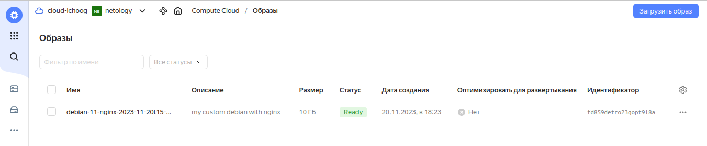
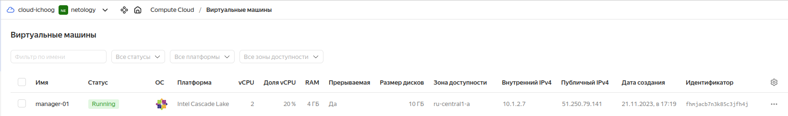
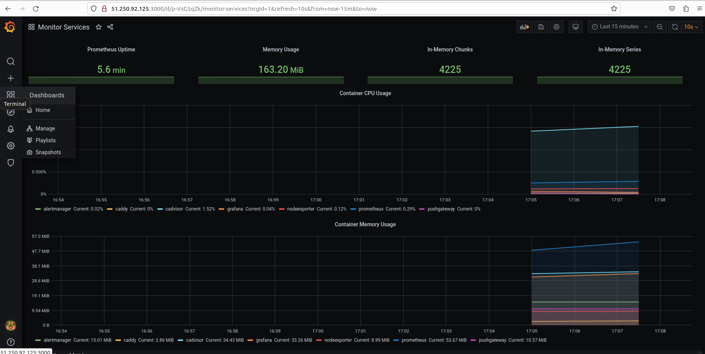
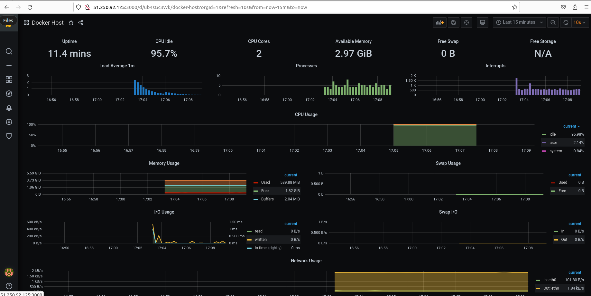

# Домашнее задание к занятию 4. «Оркестрация группой Docker-контейнеров на примере Docker Compose»


## Задача 1

Создайте собственный образ любой операционной системы (например ubuntu-20.04) с помощью Packer ([инструкция](https://cloud.yandex.ru/docs/tutorials/infrastructure-management/packer-quickstart)).

Чтобы получить зачёт, вам нужно предоставить скриншот страницы с созданным образом из личного кабинета YandexCloud.



## Задача 2

**2.1.** Создайте вашу первую виртуальную машину в YandexCloud с помощью web-интерфейса YandexCloud.        

**2.2.*** **(Необязательное задание)**      
Создайте вашу первую виртуальную машину в YandexCloud с помощью Terraform (вместо использования веб-интерфейса YandexCloud).
Используйте Terraform-код в директории ([src/terraform](https://github.com/netology-group/virt-homeworks/tree/virt-11/05-virt-04-docker-compose/src/terraform)).

Чтобы получить зачёт, вам нужно предоставить вывод команды terraform apply и страницы свойств, созданной ВМ из личного кабинета YandexCloud.
```
data.template_file.instance_userdata: Reading...
data.template_file.instance_userdata: Read complete after 0s [id=dbdb08b279f4603b7f6d8bc55691bc53cc1f0f441dc5f36ed54859fa3e058e48]
yandex_compute_instance.manager[0]: Refreshing state... [id=fhmccb85l80sglnvg85n]

Terraform used the selected providers to generate the following execution plan. Resource actions are indicated with the following symbols:
  + create

Terraform will perform the following actions:

  # yandex_compute_instance.manager[0] will be created
  + resource "yandex_compute_instance" "manager" {
      + allow_stopping_for_update = true
      + created_at                = (known after apply)
      + description               = "manager-01"
      + folder_id                 = "b1g1ptkqd96nl8peatpn"
      + fqdn                      = (known after apply)
      + hostname                  = "manager-01"
      + id                        = (known after apply)
      + metadata                  = {
          + "user-data" = <<-EOT
                #cloud-config
                
                locale: ru_RU.UTF-8
                
                timezone: Europe/Moscow
                
                users:
                  - name: centos
                    groups: sudo
                    lock-passwd: false
                    shell: /bin/bash
                    sudo: ['ALL=(ALL) NOPASSWD:ALL']
                    ssh-authorized-keys:
                      - ssh-rsa AAAAB3NzaC1yc2EAAAADAQABAAABgQC62FDKK90+G1QWkOTt6o/b2W1cH8qg6YvpIVAV/n9pdQ5ggEJciq06Dn+Bv8SPp6X5EwR+BmAGcA6FbJ9hGW4HmCi+/ALoSsl894RGD5Ayd8TOj2kRGzAVwMqZT/XGkASD7EMn8x8WG39bPBG2Br+mtPqdcrbjRw3M/seu88oZ8dikoaFDVug332YcdGA9H3Oz0sMoap9VHsKuLKbmQOhHVE8n94T8YAQA/N+gFCJh6b4WlA75XqJeLPUZ8eM/7ds4ITa0CWckoSCZMHVrvizRuagB4/ay60auiSsXbNXNbLCASo6a6mDXOySRA3sv4r+ib+Kh+pxyKpqds2LS8MXT6Lk+JOKMzWkhW2uMm27By9d0rLIcxu09Ek9UeJG8V/IvITwhAadyv++daOC0Xv2i6Tbwr99pdUapzNhin4UjE9udU4WM1eoGUJb25/sc1NZhUHuPigD9z6FskTXdMUDc+itjk3Bess1rJfvsXP8MQwAEHEZ4+YSFPkWm/Xwu9XE=
            EOT
        }
      + name                      = "manager-01"
      + network_acceleration_type = "standard"
      + platform_id               = "standard-v2"
      + service_account_id        = (known after apply)
      + status                    = (known after apply)
      + zone                      = "ru-central1-a"

      + boot_disk {
          + auto_delete = true
          + device_name = (known after apply)
          + disk_id     = (known after apply)
          + mode        = (known after apply)

          + initialize_params {
              + block_size  = (known after apply)
              + description = (known after apply)
              + image_id    = "fd8htefubdfrgrdgh6dj"
              + name        = (known after apply)
              + size        = 10
              + snapshot_id = (known after apply)
              + type        = "network-hdd"
            }
        }

      + network_interface {
          + index              = (known after apply)
          + ip_address         = (known after apply)
          + ipv4               = true
          + ipv6               = (known after apply)
          + ipv6_address       = (known after apply)
          + mac_address        = (known after apply)
          + nat                = true
          + nat_ip_address     = (known after apply)
          + nat_ip_version     = (known after apply)
          + security_group_ids = (known after apply)
          + subnet_id          = "e9bgeu87igi6s84k1p9t"
        }

      + resources {
          + core_fraction = 20
          + cores         = 2
          + memory        = 4
        }

      + scheduling_policy {
          + preemptible = true
        }
    }

Plan: 1 to add, 0 to change, 0 to destroy.

Do you want to perform these actions?
  Terraform will perform the actions described above.
  Only 'yes' will be accepted to approve.

  Enter a value: yes

yandex_compute_instance.manager[0]: Creating...
yandex_compute_instance.manager[0]: Still creating... [10s elapsed]
yandex_compute_instance.manager[0]: Still creating... [20s elapsed]
yandex_compute_instance.manager[0]: Still creating... [30s elapsed]
yandex_compute_instance.manager[0]: Still creating... [40s elapsed]
yandex_compute_instance.manager[0]: Still creating... [50s elapsed]
yandex_compute_instance.manager[0]: Still creating... [1m0s elapsed]
yandex_compute_instance.manager[0]: Creation complete after 1m5s [id=fhmjacb7n3k85c3jfh4j]

Apply complete! Resources: 1 added, 0 changed, 0 destroyed.
```


## Задача 3

С помощью Ansible и Docker Compose разверните на виртуальной машине из предыдущего задания систему мониторинга на основе Prometheus/Grafana.
Используйте Ansible-код в директории ([src/ansible](https://github.com/netology-group/virt-homeworks/tree/virt-11/05-virt-04-docker-compose/src/ansible)).

Чтобы получить зачёт, вам нужно предоставить вывод команды "docker ps" , все контейнеры, описанные в [docker-compose](https://github.com/netology-group/virt-homeworks/blob/virt-11/05-virt-04-docker-compose/src/ansible/stack/docker-compose.yaml),  должны быть в статусе "Up".

```
[root@manager-01 ~]# docker ps
CONTAINER ID   IMAGE                              COMMAND                  CREATED          STATUS                            PORTS                                                                              NAMES
74ddf2dc80c9   grafana/grafana:7.4.2              "/run.sh"                16 seconds ago   Up 3 seconds                      3000/tcp                                                                           grafana
5c8aa1147f55   gcr.io/cadvisor/cadvisor:v0.47.0   "/usr/bin/cadvisor -…"   16 seconds ago   Up 3 seconds (health: starting)   8080/tcp                                                                           cadvisor
9cfdd2519a3b   prom/node-exporter:v0.18.1         "/bin/node_exporter …"   16 seconds ago   Up 4 seconds                      9100/tcp                                                                           nodeexporter
e3ba650eafcc   prom/alertmanager:v0.20.0          "/bin/alertmanager -…"   16 seconds ago   Up 4 seconds                      9093/tcp                                                                           alertmanager
44dede18945b   prom/pushgateway:v1.2.0            "/bin/pushgateway"       16 seconds ago   Up 3 seconds                      9091/tcp                                                                           pushgateway
e9b3b74695c2   prom/prometheus:v2.17.1            "/bin/prometheus --c…"   16 seconds ago   Up 4 seconds                      9090/tcp                                                                           prometheus
6cc62cb7db88   stefanprodan/caddy                 "/sbin/tini -- caddy…"   16 seconds ago   Up 3 seconds                      0.0.0.0:3000->3000/tcp, 0.0.0.0:9090-9091->9090-9091/tcp, 0.0.0.0:9093->9093/tcp   caddy

```


## Задача 4

1. Откройте веб-браузер, зайдите на страницу http://<внешний_ip_адрес_вашей_ВМ>:3000.
2. Используйте для авторизации логин и пароль из [.env-file](https://github.com/netology-group/virt-homeworks/blob/virt-11/05-virt-04-docker-compose/src/ansible/stack/.env).
3. Изучите доступный интерфейс, найдите в интерфейсе автоматически созданные docker-compose-панели с графиками([dashboards](https://grafana.com/docs/grafana/latest/dashboards/use-dashboards/)).
4. Подождите 5-10 минут, чтобы система мониторинга успела накопить данные.

Чтобы получить зачёт, предоставьте: 

- скриншот работающего веб-интерфейса Grafana с текущими метриками


