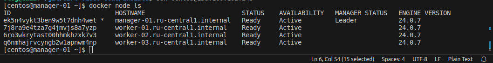
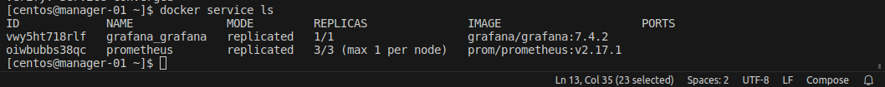

# Домашнее задание к занятию 5. «Оркестрация кластером Docker контейнеров на примере Docker Swarm»

## Задача 1

Дайте письменые ответы на вопросы:

- В чём отличие режимов работы сервисов в Docker Swarm-кластере: replication и global?
  - Основное отличие режимов работы сервисов в Docker Swarm-кластере заключается в том, что в режиме replication сервис запускается на определенном количестве узлов, а в режиме global - на каждом узле кластера.
- Какой алгоритм выбора лидера используется в Docker Swarm-кластере?
  - В Docker Swarm-кластере используется алгоритм выбора лидера, называемый "Рафт" (Raft). Этот алгоритм был разработан для обеспечения консенсуса в распределенных системах и обеспечивает выбор лидера путем голосования между узлами кластера. Каждый узел имеет свой голос, и лидером становится узел с наибольшим количеством голосов. Если текущий лидер выходит из строя, то новый лидер выбирается автоматически. Этот алгоритм обеспечивает высокую доступность и отказоустойчивость в Docker Swarm-кластере.
- Что такое Overlay Network?
  - Overlay Network - это виртуальная сеть, которая создается поверх физических сетей и позволяет связывать контейнеры между собой в Docker Swarm-кластере. Overlay Network обеспечивает изоляцию трафика между контейнерами, а также автоматическое маршрутизацию трафика между узлами кластера. Контейнеры, подключенные к Overlay Network, могут общаться друг с другом, как будто они находятся в одной локальной сети. Это позволяет создавать распределенные приложения, которые могут работать на нескольких узлах кластера.

## Задача 2

Создайте ваш первый Docker Swarm-кластер в Яндекс Облаке.

Чтобы получить зачёт, предоставьте скриншот из терминала (консоли) с выводом команды:
```
docker node ls
```
### Ответ


## Задача 3

Создайте ваш первый, готовый к боевой эксплуатации кластер мониторинга, состоящий из стека микросервисов.

Чтобы получить зачёт, предоставьте скриншот из терминала (консоли), с выводом команды:
```
docker service ls
```
### Ответ


